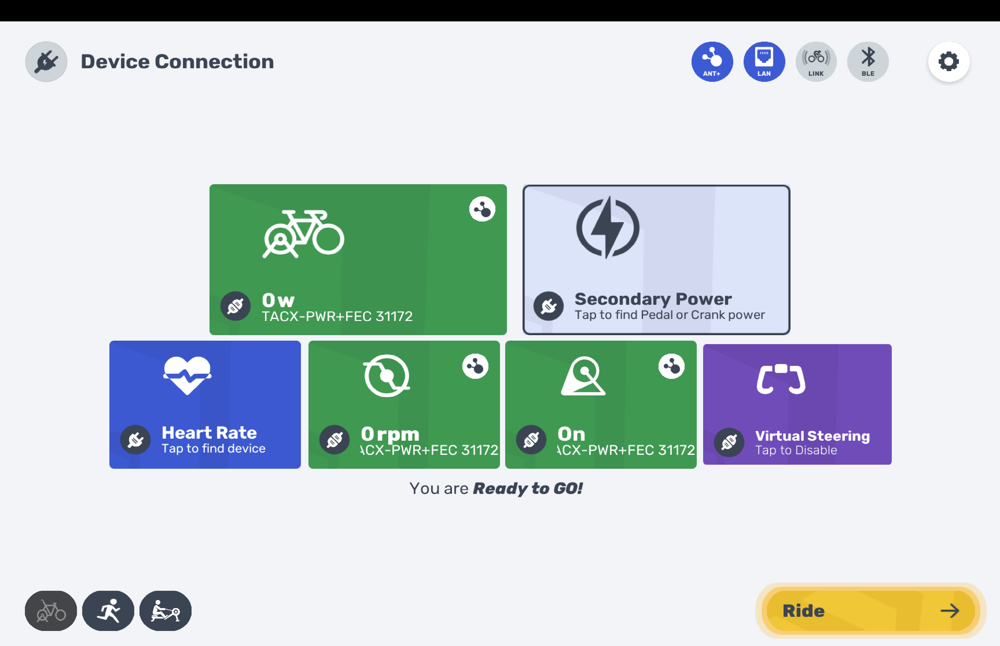
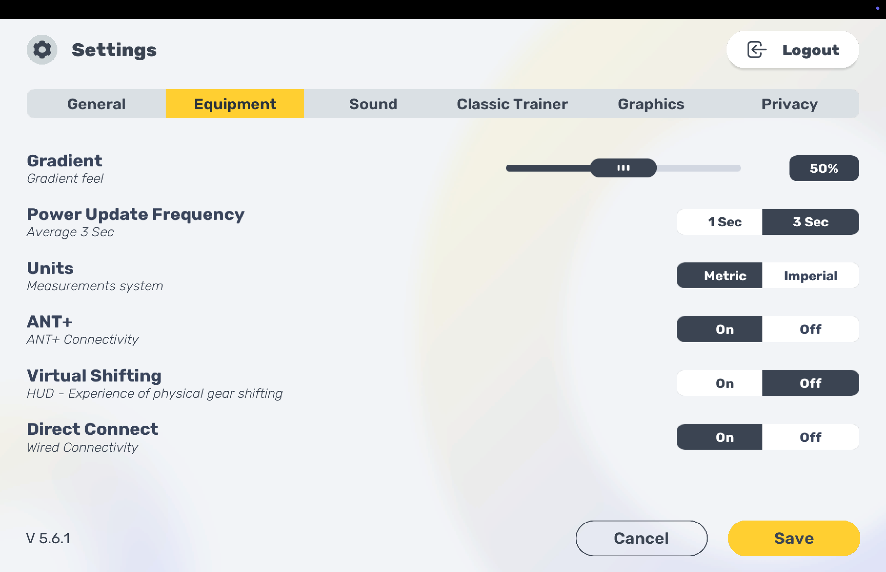

# Fix ANT+ on Mac for MyWhoosh

## The Problem

ANT+ doesn't work on the Mac App Store version of MyWhoosh. The ANT+ toggle in settings turns itself off after saving, and no ANT+ devices are detected. This affects all Mac users (M1, M2, M3, M4, Intel).

## Root Cause

The Mac App Store version is missing a single sandbox entitlement: `com.apple.security.device.usb`.

MyWhoosh already ships with full ANT+ support — Garmin's official ANT+ SDK (`libant.dylib`) is bundled in the app with all the code to communicate with ANT+ devices. But on macOS, App Store apps run in a sandbox and need to explicitly declare USB device access. Without that entitlement, the ANT+ SDK silently fails to open the USB dongle.

The app has the Bluetooth entitlement, the network entitlements, the file access entitlement — but **not** the USB one.

**This is a one-line fix for the MyWhoosh developers.** They just need to add to their entitlements plist:

```
com.apple.security.device.usb = true
```

This was likely missed because debug/development builds aren't sandboxed, so ANT+ would work fine during testing but fail in the App Store release.

## Proof

ANT+ working on M1 MacBook Pro with CooSpo USB ANT+ Stick and Garmin TACX Flux S:

### Device Connection — TACX connected via ANT+


### Settings — ANT+ toggled On (stays on after save)


## Workaround

You can fix this yourself by making a copy of the app and re-signing it with the correct entitlements. This doesn't touch your original App Store install.

### 1. Copy the app

```bash
cp -R "/Applications/MyWhoosh Indoor Cycling App.app" "/Applications/MyWhoosh ANT+.app"
```

### 2. Remove the App Store receipt

(Otherwise macOS won't launch the copy)

```bash
rm -rf "/Applications/MyWhoosh ANT+.app/Contents/_MASReceipt"
```

### 3. Create an entitlements file

Save this as `/tmp/mywhoosh-entitlements.plist`:

```xml
<?xml version="1.0" encoding="UTF-8"?>
<!DOCTYPE plist PUBLIC "-//Apple//DTD PLIST 1.0//EN"
  "https://www.apple.com/DTDs/PropertyList-1.0.dtd">
<plist version="1.0">
<dict>
    <key>com.apple.security.app-sandbox</key>
    <true/>
    <key>com.apple.security.device.bluetooth</key>
    <true/>
    <key>com.apple.security.device.usb</key>
    <true/>
    <key>com.apple.security.files.user-selected.read-write</key>
    <true/>
    <key>com.apple.security.network.client</key>
    <true/>
    <key>com.apple.security.network.server</key>
    <true/>
</dict>
</plist>
```

This is the same as the original entitlements, just with `com.apple.security.device.usb` added.

### 4. Re-sign everything

```bash
# Re-sign all dylibs
/usr/bin/find "/Applications/MyWhoosh ANT+.app" -name "*.dylib" \
  -exec codesign --force --sign - {} \;

# Re-sign CrashReportClient
codesign --force --sign - \
  "/Applications/MyWhoosh ANT+.app/Contents/UE4/Engine/Binaries/Mac/CrashReportClient.app"

# Re-sign main binary with new entitlements
codesign --force --sign - \
  --entitlements /tmp/mywhoosh-entitlements.plist \
  "/Applications/MyWhoosh ANT+.app/Contents/MacOS/MyWhoosh Indoor Cycling App"

# Re-sign entire app bundle
codesign --force --sign - \
  --entitlements /tmp/mywhoosh-entitlements.plist \
  "/Applications/MyWhoosh ANT+.app"
```

### 5. Launch

1. **Unplug and replug your ANT+ dongle** (ensures clean USB state)
2. Launch `/Applications/MyWhoosh ANT+.app`
3. Go to Settings > Equipment, turn ANT+ **On**, and Save — this time it stays on
4. Go to Device Connection — your trainer, HR strap, cadence sensor etc. should all show up via ANT+

## Notes

- You'll need to redo this after MyWhoosh updates from the App Store (but the original app is untouched, so updates work normally)
- Tested on M1 MacBook Pro with CooSpo USB ANT+ Stick and Garmin TACX Flux S
- Confirmed working: power, cadence, speed, and FE-C trainer control via ANT+
